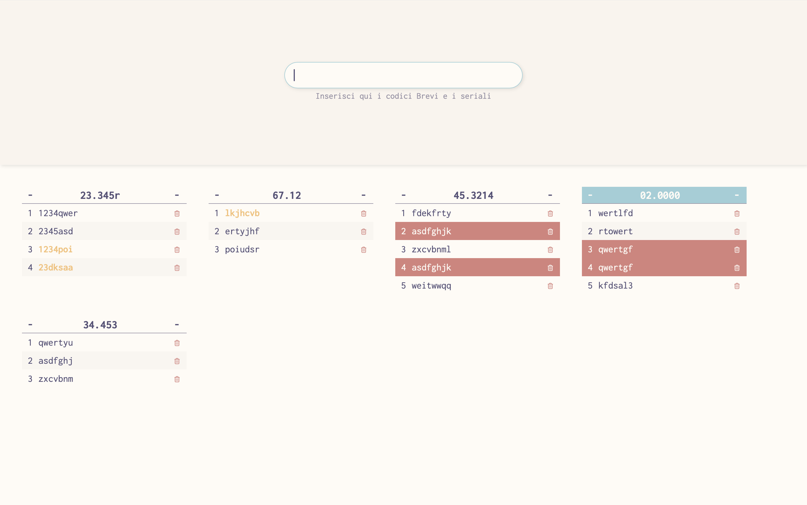

# Tabelle seriali

Questa è una piccola webapp in grado di creare tabelle in maniera dinamica distinguendo tra seriali e codici interni.
[Qui](https://tussis88.github.io/serialtabs/) si può trovare la live preview.

## Utilizzo

_Questa webapp è utilizzabile anche con i lettori di codice a barre._
Inserendo un codice interno nel campo di input(_sparandolo_ con il lettore o digitandolo manualmente e premendo invio), il programma andrà a creare automaticamente una tabella e renderà quel codice _attivo_.
I seriali che verranno inseriti di seguito andranno a riempire la tabella del codice attivo.

Per rendere attiva un'altra tabella o crearne una nuova, è sufficiente inserire il codice interno.

## Funzionalità

- La barra di input sarà sempre in _focus_ permettendo all'utente di utilizzare l'app senza dover stare davanti al computer.
- Il programma funziona con diversi settaggi del lettore di codice a barre, non è quindi necessario modificarne le impostazioni.
- i seriali sono renderizzati con un font _monospace_. Questo facilità l'identificazione di seriali _errati_ all'interno della tabella.
- Cliccando su un seriale questo verrà autmaticamente copiato nella _clipboard_ del computer potendolo così comodamente incollare dove serve. I seriali copiati in questo modo cambieranno colore.
- Il programma segnalerà se un seriale è già stato inserito.

Per resettare i dati inseriti è sufficiente aggiornare la pagine.

